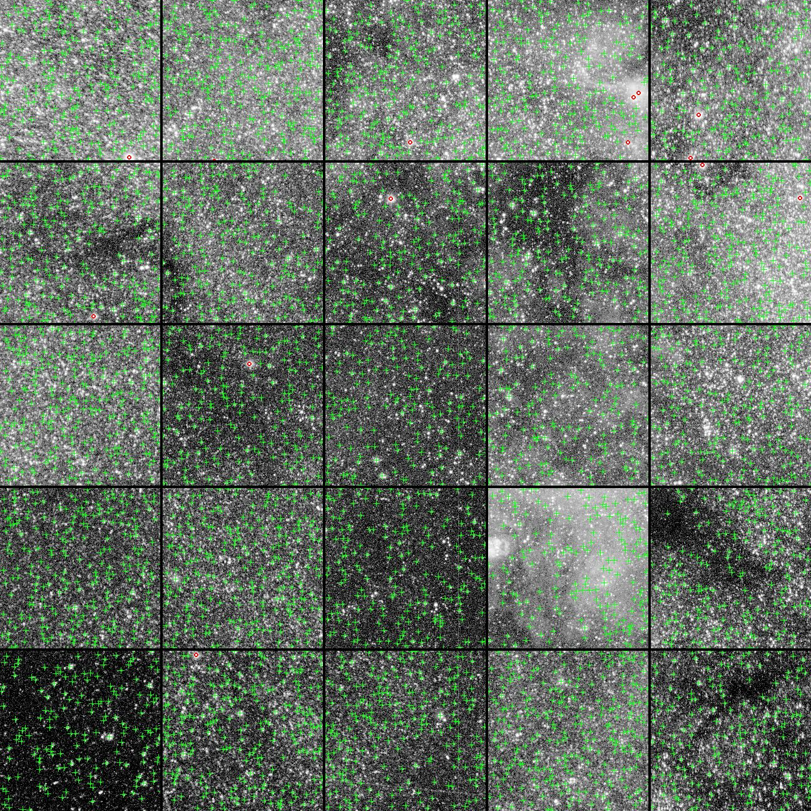

# Star Detector — 天文图像星点检测器

从16bit天文图像中检测星点坐标，集成PSF拟合过滤、FWHM剪裁和圆度过滤，输出通过所有过滤的真实星点坐标列表。

## 检测效果示例



*红色十字标记为检测到的星点位置（直方图拉伸后显示）*

## 特性

- **16bit原生输入**：直接接收uint16图像数据，适配业余天文相机ADC
- **à-trous小波结构图提取**：B3v样条核，可分离卷积，高效分离星点信号与背景
- **32倍降采样低频层提取**：先降采样→小波滤波→超采样，避免大图高斯卷积瓶颈
- **迭代sigma-clip二值化**：分离背景噪声与星点信号，自适应阈值
- **内联Moffat4 PSF拟合**：批量拟合过滤不良候选点
- **FWHM med+3σ剪裁**：保留FWHM在合理范围的星点，剔除异常PSF
- **圆度过滤**：剔除长轴/短轴>2x的拉长星点

## 检测流水线

```
输入: uint16图像
  │
  ├─ 1. uint16→float32转换
  ├─ 2. 热像素中值滤波 (radius=1)
  ├─ 3. 结构图提取 (à-trous小波低频层提取 → 细节层)
  ├─ 4. 中值滤波细节层去噪 (3×3)
  ├─ 5. 迭代sigma-clip二值化 (clipSigma=9.0)
  ├─ 6. 局部极大值检测(radius=3) + 阈值过滤 → 疑似星点
  ├─ 7. 窗口内连通域分析 → 候选星点列表
  ├─ 8. 批量Moffat4拟合 (OpenMP 16线程并行)
  ├─ 9. 拟合过滤: status≠OK → 剔除
  ├─ 10. FWHM过滤: |fwhm-med| > fwhmClipSigma×MAD → 剔除
  ├─ 11. 圆度过滤: max(sx,sy)/min(sx,sy) > maxAxisRatio → 剔除
  │
  └─ 输出: 星点坐标列表 [(x,y), ...]
```

## 数据结构

### SDetParams — 检测参数

| 字段 | 类型 | 默认值 | 说明 |
|------|------|--------|------|
| structureLayers | int | 5 | à-trous小波层数，控制结构图尺度 |
| hotPixelFilterRadius | int | 1 | 热像素中值滤波半径 |
| iterativeClipSigma | float | 9.0 | 迭代sigma-clip阈值倍数 |
| iterativeMaxRounds | int | 5 | sigma-clip最大迭代轮数 |
| medianFilterDetail | int | 1 | 是否对细节层做3×3中值滤波去噪 |
| maxStars | int | 0 | 最大输出星点数，0=不限制 |
| fitRadius | int | 8 | PSF拟合采样区半径 |
| fwhmClipSigma | float | 3.0 | FWHM剪裁sigma倍数 |
| maxAxisRatio | float | 2.0 | 最大轴比（长轴/短轴） |

## C API

```c
#include "star_detector.h"

// 创建/销毁
StarDetectorHandle sdet_create(const SDetParams *params);
void sdet_destroy(StarDetectorHandle handle);

// 检测：输入uint16图像，输出坐标列表
int sdet_detect(StarDetectorHandle handle,
                const uint16_t *image, int width, int height,
                double **out_x, double **out_y, int *out_count);

void sdet_free_coords(double *coords);
```

## Python使用

```python
from star_detector import StarDetector, SDetParamsPy
import numpy as np

image = ...  # np.ndarray, uint16或float32(自动转换)

# 使用默认参数
det = StarDetector()
coords = det.detect(image)
print(f"检测到 {len(coords)} 颗星")

# 自定义参数
params = SDetParamsPy(
    iterativeClipSigma=9.0,
    fwhmClipSigma=3.0,
    maxAxisRatio=2.0,
    fitRadius=8,
)
det = StarDetector(params=params)
coords = det.detect(image)

for x, y in coords[:10]:
    print(f"  ({x:.1f}, {y:.1f})")

det.close()
```

## 算法特点

### à-trous小波结构图提取

使用B3v样条核 `[1/16, 1/4, 3/8, 1/4, 1/16]` 进行à-trous（多孔）小波变换：
- 可分离卷积（先水平后垂直），计算量O(n×k)而非O(n×k²)
- scale间距 = 2^scale，逐层扩大感受野
- 细节层 = 原图 - 低频层，提取星点尺度结构

### 32倍降采样低频层提取

传统方法在大图上做高斯卷积提取低频层非常慢（sigma=33时耗时75秒）。改进方案：

1. **32倍降采样**（面积平均）：4500×3600 → 141×113
2. **à-trous小波滤波**：在降采样图上做scale0+scale1两层滤波
3. **32倍双线性超采样**：恢复到原始分辨率

总耗时从75秒降至<1秒，同时保持低频层质量。

### 迭代sigma-clip二值化

天文图像细节层中，星点信号污染了全图统计量，导致简单阈值法失效。迭代sigma-clip方法：

1. 计算当前像素集的med和MAD（MAD×1.4826≈σ）
2. 剔除所有 > med + clipSigma × MAD 的像素（只做上界clipping）
3. 重复直到收敛（med/MAD变化<0.1%）或达到最大轮数
4. 收敛后的med/MAD反映纯背景噪声统计

clipSigma=9.0时，阈值足够高以切断噪声连接，同时保留真实星点信号。

### FWHM med+3σ剪裁

真实星点的FWHM应集中在某个范围内。计算所有拟合成功星点的FWHM中位数和MAD，剔除 |fwhm-med| > fwhmClipSigma × MAD 的异常值，有效去除：
- 拟合到噪声的假星点（FWHM异常小）
- 拟合到星云/星系的扩展源（FWHM异常大）
- 饱和星点（PSF变形）

### 圆度过滤

正常星点应近似圆形。长轴/短轴比 > maxAxisRatio 的星点被剔除，有效去除：
- 拉长的卫星轨迹
- 银河/星云中的线性结构
- 拟合发散的异常结果

## 性能

测试环境：16线程CPU + 64GB内存

| 图像 | 分辨率 | 检测星数 | 耗时 |
|------|--------|---------|------|
| Red帧 | 4500×3600 | ~20000 | ~2s |

## 编译

**依赖**：MinGW-w64 g++ (C++17), OpenMP

```bash
make all
```

输出 `star_detector.dll`

**环境变量**：
- `STAR_DETECTOR_LOG_LEVEL`：日志级别（0=INFO, 1=DEBUG, 2=WARN, 3=ERROR），默认INFO

## 依赖

- [Dynamic-PSF](https://github.com/fujiaze/Dynamic-PSF) — Moffat4 PSF拟合引擎（算法同源，Star Detector内联了Moffat4拟合代码，编译时无需链接Dynamic-PSF）
- [Astro-Image-Io](https://github.com/fujiaze/Astro-Image-Io) — FITS/XISF图像读取（Python端可选）

## 参考文献

本模块算法参考以下开源项目：

- **[SExtractor](https://github.com/astromatic/sextractor)** (Emmanuel Bertin, CEA/AIM/UParisSaclay)
  - 网格化背景估计（mesh-based background estimation）
  - 直方图模式估计（histogram mode estimation）
  - 迭代sigma-clip背景计算
  - 中值滤波平滑背景图
  - Lutz算法连通域分析
  - 许可证：GPL v3

- **[PSFEx](https://github.com/astromatic/psfex)** (Emmanuel Bertin, IAP/CNRS/UPMC)
  - chi²筛选机制
  - 椭圆度/拉长度过滤
  - FWHM范围过滤
  - 许可证：GPL v3

核心算法已根据MIT许可重新实现，参考了SExtractor/PSFEx的设计思路但代码完全独立。

## 许可

MIT License
